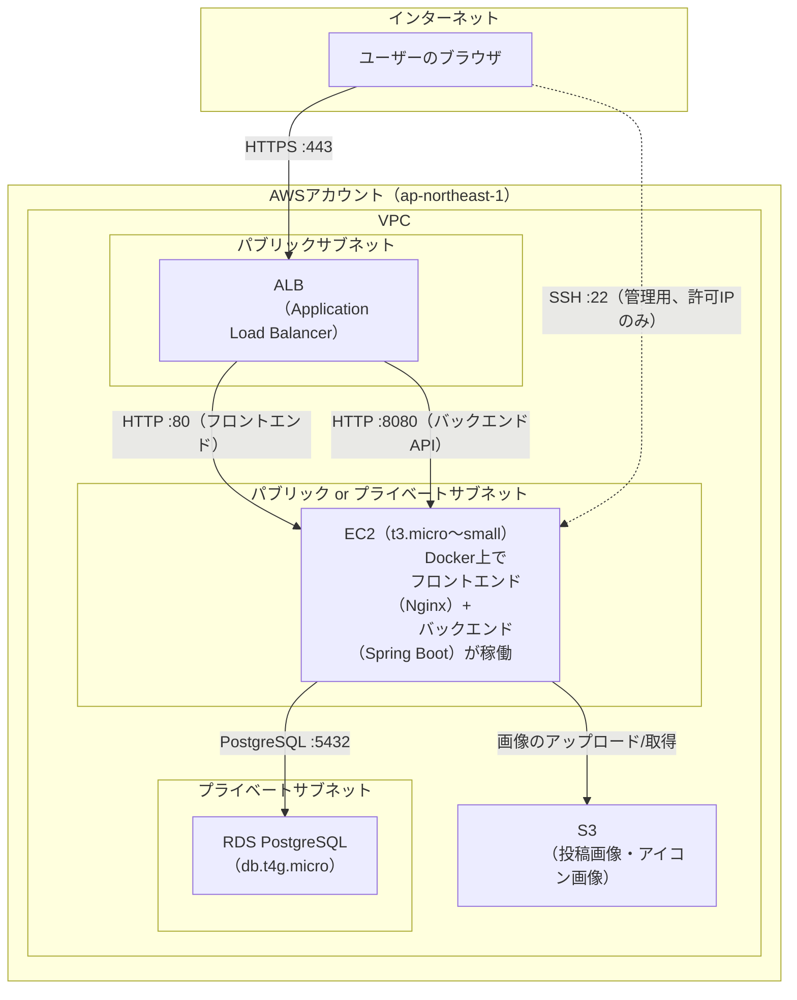

# インフラ構成

本アプリケーションをAWS上にデプロイする場合を想定したインフラ構成についてまとめる。マネジメントコンソールは使わず、AWS CLIでの認証設定のもと、Terraformによるコード管理（IaC）でインフラを構築する方針とする。

**現時点では、実際にAWS上へデプロイするかどうかは未確定である。** 認証機能を持つマルチユーザー向けSNSアプリケーションという性質上、可用性を確保するため、**ロードバランサー（ALB）を挟んだ構成を前提として先行して設計しておく**ものである。実際にデプロイする段階になった時点で、コストとのバランスを見て本構成を見直す可能性がある。

## 全体構成図



- ALBを経由してユーザーからのHTTPS通信を受け付け、EC2上のフロントエンド（Nginx）・バックエンド（Spring Boot）に振り分ける
- データベースはRDS（マネージドPostgreSQL）に分離する
- 投稿画像・アイコン画像はS3に保存し、EC2上のバックエンドがAWS SDK経由でアップロード・URL発行を行う
- SSHでの管理アクセスは許可された管理者のグローバルIPアドレスに限定する

## 使用するAWSサービス（想定）

| サービス | 役割 |
|---|---|
| VPC / サブネット | ALB・EC2・RDSを収容するネットワーク |
| ALB（Application Load Balancer） | インターネットからのHTTPS通信を受け付け、EC2へ振り分ける。将来的な複数台構成（スケールアウト）への拡張余地を持たせる |
| ACM（AWS Certificate Manager） | ALBでのHTTPS終端に使うSSL/TLS証明書 |
| EC2 | フロントエンド（Nginx配信）・バックエンド（Spring Boot）を動かすサーバー |
| RDS（PostgreSQL） | データベース |
| S3 | 投稿画像・プロフィールアイコン画像の保存先 |
| セキュリティグループ | ALB・EC2・RDSへの通信をIPアドレス／サービス単位で制御するファイアウォール |
| Route 53（任意） | 独自ドメインを使う場合の名前解決 |

## ディレクトリ構成（想定）

Terraformのコードは `infra/` にまとめる想定。

```
RaiseTimeLine/
├── infra/                  # Terraformコード一式
│   ├── backend.tf          # tfstateの保管先（S3）の設定
│   ├── providers.tf        # 利用するプロバイダ（aws / tls / local）の設定
│   ├── variables.tf        # 環境ごとに変わる値（リージョン・許可IP・DBパスワード等）
│   ├── network.tf          # VPC・サブネット・セキュリティグループ
│   ├── alb.tf              # ALB・ターゲットグループ・リスナー
│   ├── ec2.tf              # EC2インスタンス・SSHキーペア
│   ├── database.tf         # RDS（PostgreSQL）
│   ├── s3.tf               # 画像保存用S3バケット
│   ├── outputs.tf          # apply後に表示する値（ALBのDNS名、RDSのエンドポイント等）
│   ├── backend.hcl         # tfstate保管先バケット名（Git管理対象外）
│   └── terraform.tfvars    # 実際の値（Git管理対象外）
├── backend/
│   └── Dockerfile
├── frontend/
│   ├── Dockerfile
│   └── nginx.conf
├── docker-compose.yml        # 開発環境用
├── docker-compose.prod.yml   # 本番イメージのビルド定義
└── .env.prod.example
```

## デプロイの流れ（想定）

EC2インスタンスのメモリリソースを考慮し、アプリケーションのビルドはローカル環境（またはCI環境）で行い、ビルド済みのイメージをEC2に転送する方式を想定する。

1. Terraformで `infra/` の内容をAWSに適用し、VPC・ALB・EC2・RDS・S3を作成する
2. バックエンド・フロントエンドのDockerイメージをビルドする
3. ビルドしたイメージをEC2に転送し、`docker run`（または`docker compose`）でコンテナを起動する
4. ALBのDNS名（またはこれに紐づけた独自ドメイン）にブラウザでアクセスし、動作確認する

## 運用上の注意点（想定）

- EC2・RDSは小規模インスタンスタイプでの運用を想定するが、アクセス数の増加に応じてインスタンスタイプの見直しを行う
- 利用しない期間がある場合は `terraform destroy` でインフラごと削除することも選択肢とする
- DBパスワード等の秘匿情報はTerraformコードに直書きせず、Git管理対象外のファイル（`terraform.tfvars` / `.env.prod`）で管理する
- AWSのAccess Key・Secret Access Keyは絶対にGit・チャット等に貼り付けない
- 実際にAWS上へデプロイするかどうか、上記の構成のままで進めるかは、実装が進んだ段階で改めて判断する
