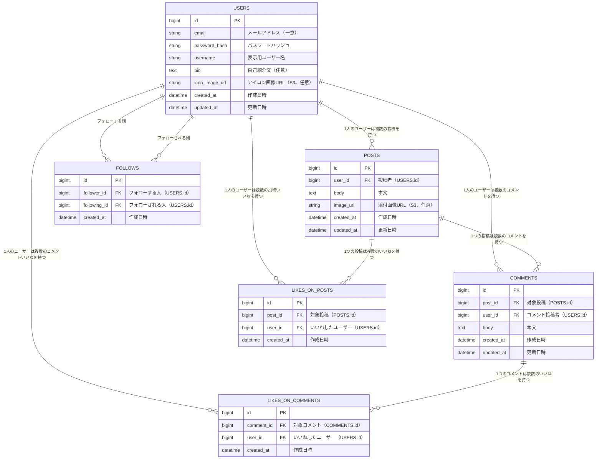

# データベース設計（ER図）

## 1. 前提
- マルチユーザー対応のため、ユーザーテーブル（USERS）を持つ
- いいねは「投稿へのいいね」「コメントへのいいね」の両方が必要であり、対象の種類によってテーブルを分ける案（LIKES_ON_POSTS / LIKES_ON_COMMENTS）を採用する。1テーブルに対象種別カラムを持たせるポリモーフィック関連の案もあるが、外部キー制約による整合性担保を優先し、テーブル分割案を採用する
- フォローは「フォローする人」と「フォローされる人」の自己参照的な多対多関係として、中間テーブル（FOLLOWS）で管理する
- データベース製品は [技術スタック.md](./技術スタック.md) の通りPostgreSQLを使用する。以降のカラム型はPostgreSQLの型名で記載する

## 2. ER図

## 3. テーブル定義

### USERS（ユーザー）

| カラム名 | 型 | 制約 | 説明 |
|---|---|---|---|
| id | BIGSERIAL | PK | ユーザーID |
| email | VARCHAR(255) | UNIQUE, NOT NULL | メールアドレス（ログインID） |
| password_hash | VARCHAR(255) | NOT NULL | パスワードのハッシュ値 |
| username | VARCHAR(30) | NOT NULL | 表示用ユーザー名（重複許容） |
| bio | TEXT | NULL可 | 自己紹介文 |
| icon_image_url | VARCHAR(500) | NULL可 | アイコン画像のS3 URL |
| created_at | TIMESTAMP | NOT NULL | 作成日時 |
| updated_at | TIMESTAMP | NOT NULL | 更新日時 |

### POSTS（投稿）

| カラム名 | 型 | 制約 | 説明 |
|---|---|---|---|
| id | BIGSERIAL | PK | 投稿ID |
| user_id | BIGINT | FK（USERS.id）, NOT NULL | 投稿者 |
| body | TEXT | NOT NULL | 本文 |
| image_url | VARCHAR(500) | NULL可 | 添付画像のS3 URL |
| created_at | TIMESTAMP | NOT NULL | 作成日時 |
| updated_at | TIMESTAMP | NOT NULL | 更新日時（編集時に更新） |

- 投稿削除時、紐づくCOMMENTS・LIKES_ON_POSTSはON DELETE CASCADEで合わせて削除する

### COMMENTS（コメント）

| カラム名 | 型 | 制約 | 説明 |
|---|---|---|---|
| id | BIGSERIAL | PK | コメントID |
| post_id | BIGINT | FK（POSTS.id）, NOT NULL | 対象投稿 |
| user_id | BIGINT | FK（USERS.id）, NOT NULL | コメント投稿者 |
| body | TEXT | NOT NULL | 本文 |
| created_at | TIMESTAMP | NOT NULL | 作成日時 |
| updated_at | TIMESTAMP | NOT NULL | 更新日時（編集時に更新） |

- コメント削除時、紐づくLIKES_ON_COMMENTSはON DELETE CASCADEで合わせて削除する
- 投稿削除時、その投稿に紐づくコメントもON DELETE CASCADEで合わせて削除する

### LIKES_ON_POSTS（投稿へのいいね）

| カラム名 | 型 | 制約 | 説明 |
|---|---|---|---|
| id | BIGSERIAL | PK | いいねID |
| post_id | BIGINT | FK（POSTS.id）, NOT NULL | 対象投稿 |
| user_id | BIGINT | FK（USERS.id）, NOT NULL | いいねしたユーザー |
| created_at | TIMESTAMP | NOT NULL | 作成日時 |

- `(post_id, user_id)` にUNIQUE制約を設け、同一ユーザーによる同一投稿への二重いいねを防止する

### LIKES_ON_COMMENTS（コメントへのいいね）

| カラム名 | 型 | 制約 | 説明 |
|---|---|---|---|
| id | BIGSERIAL | PK | いいねID |
| comment_id | BIGINT | FK（COMMENTS.id）, NOT NULL | 対象コメント |
| user_id | BIGINT | FK（USERS.id）, NOT NULL | いいねしたユーザー |
| created_at | TIMESTAMP | NOT NULL | 作成日時 |

- `(comment_id, user_id)` にUNIQUE制約を設け、同一ユーザーによる同一コメントへの二重いいねを防止する

### FOLLOWS（フォロー関係）

| カラム名 | 型 | 制約 | 説明 |
|---|---|---|---|
| id | BIGSERIAL | PK | フォロー関係ID |
| follower_id | BIGINT | FK（USERS.id）, NOT NULL | フォローする人 |
| following_id | BIGINT | FK（USERS.id）, NOT NULL | フォローされる人 |
| created_at | TIMESTAMP | NOT NULL | 作成日時（フォローした日時） |

- `(follower_id, following_id)` にUNIQUE制約を設け、同一ユーザー間の重複フォローを防止する
- `follower_id = following_id`（自分自身のフォロー）はアプリケーション側のバリデーションで禁止する

## 4. 補足
- いいね数・コメント数は都度LIKES_ON_POSTS／LIKES_ON_COMMENTS／COMMENTSのCOUNTで算出する方針とし、非正規化したカウンターカラム（例：POSTS.like_count）は現時点では持たない。パフォーマンス要件が明確になった場合、非正規化カウンターの追加を将来的に検討する
- 投稿・コメントの検索（[検索.md](./機能定義/検索.md)）は、`POSTS.body` / `USERS.username` に対する`LIKE`検索（または`pg_trgm`拡張によるインデックス）を用いる想定とする
