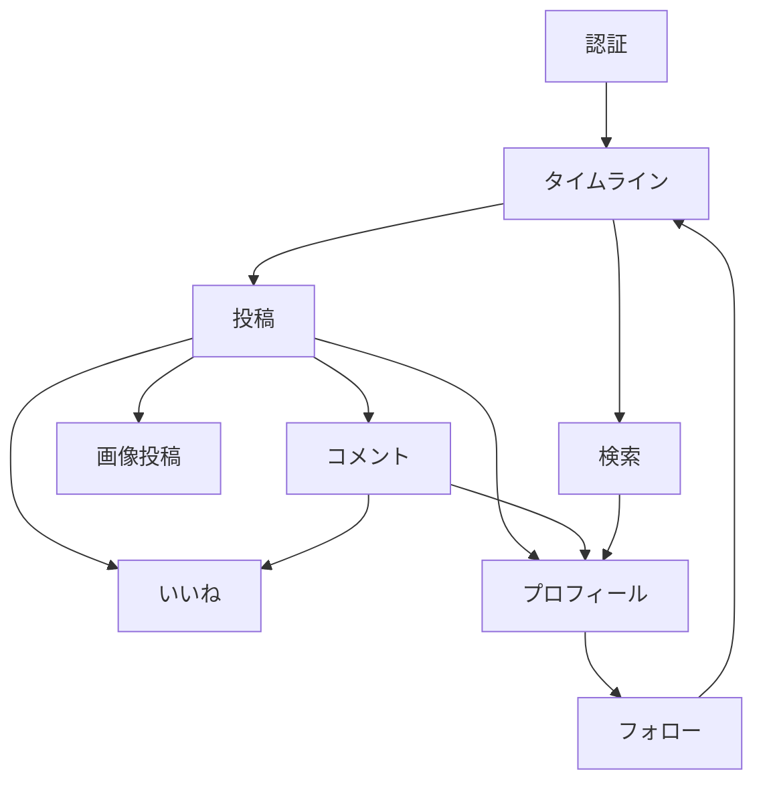

# 機能一覧

[要件定義.md](../要件定義.md) のスコープに基づく、全機能のサマリ一覧。各機能の詳細は [機能定義/](./機能定義/) 配下の対応ドキュメントを参照。

## 1. 対象内機能（実装する）

| No | 機能名 | 概要 | 詳細ドキュメント |
|---|---|---|---|
| 1 | 認証 | サインアップ・ログイン・ログアウト（メールアドレス＋パスワード） | [認証.md](./機能定義/認証.md) |
| 2 | タイムライン | 全体タイムライン／フォロー中タイムラインの2タブ表示 | [タイムライン.md](./機能定義/タイムライン.md) |
| 3 | フォロー | 他ユーザーのフォロー／フォロー解除 | [フォロー.md](./機能定義/フォロー.md) |
| 4 | プロフィール | ユーザー情報・投稿一覧の表示、自分のプロフィール編集 | [プロフィール.md](./機能定義/プロフィール.md) |
| 5 | 投稿 | テキスト（＋画像）投稿の作成・編集・削除 | [投稿.md](./機能定義/投稿.md) |
| 6 | コメント | 投稿へのコメントの作成・編集・削除（第三者コメント可） | [コメント.md](./機能定義/コメント.md) |
| 7 | いいね | 投稿・コメントへのいいね（第三者いいね可、二重いいね不可） | [いいね.md](./機能定義/いいね.md) |
| 8 | 画像投稿 | 投稿への画像添付、AWS S3への保存 | [画像投稿.md](./機能定義/画像投稿.md) |
| 9 | 検索 | キーワード検索（投稿）・ユーザー検索 | [検索.md](./機能定義/検索.md) |

## 2. 対象外機能（実装しない）

| 機能名 | 備考 |
|---|---|
| ユーザーアカウント削除 | 意図的に対象外。今後拡張したい場合は別途検討する |
| パスワード変更・再設定 | 同上 |
| 通知・メンション機能 | 同上 |
| リツイート・引用機能 | 差別化ポイントとして意図的に実装しない |
| インプレッション数（閲覧数）表示 | 差別化ポイントとして意図的に実装しない |
| ダイレクトメッセージ | 意図的に対象外 |

## 3. 機能間の関連

- 投稿者名・コメント者名のクリックを起点にプロフィール画面へ遷移し、そこでフォロー操作を行う導線を持つ
- フォロー状態はタイムライン（フォロー中タブ）の表示内容に反映される
