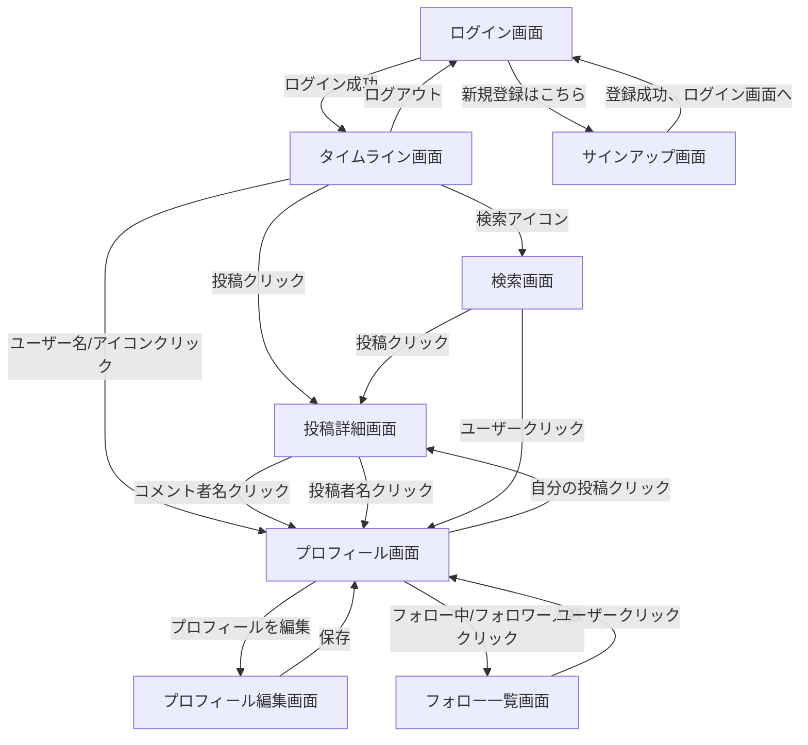

# 画面設計

[要件定義.md](../要件定義.md) および [機能一覧.md](./機能一覧.md) に基づく、画面一覧・画面遷移・レイアウトの詳細仕様。

## 1. 画面一覧

| No | 画面名 | 概要 | ログイン要否 |
|---|---|---|---|
| 1 | ログイン画面 | メールアドレス・パスワードでログインする | 不要 |
| 2 | サインアップ画面 | メールアドレス・パスワード・ユーザー名で新規登録する | 不要 |
| 3 | タイムライン画面 | 全体／フォロー中タブ、投稿フォーム、投稿一覧 | 必要 |
| 4 | 投稿詳細画面 | 投稿本文＋コメント一覧＋コメント入力欄 | 必要 |
| 5 | プロフィール画面 | ユーザー情報、フォロー状況、そのユーザーの投稿一覧 | 必要 |
| 6 | プロフィール編集画面 | ユーザー名・自己紹介・アイコン画像の編集 | 必要（本人のみ） |
| 7 | フォロー一覧画面 | 対象ユーザーのフォロー中一覧／フォロワー一覧 | 必要 |
| 8 | 検索画面 | キーワード検索（投稿）・ユーザー検索 | 必要 |

## 2. 画面遷移図



## 3. ログイン画面

### 3.1 レイアウト（イメージ）
```
+----------------------------------+
|          RaiseTimeLine            |
|                                   |
|  メールアドレス [____________]   |
|  パスワード     [____________]   |
|                                   |
|         [ ログイン ]              |
|                                   |
|  アカウントをお持ちでない方はこちら |
+----------------------------------+
```

### 3.2 要素
- メールアドレス入力欄、パスワード入力欄（マスク表示）
- ログインボタン
- サインアップ画面へのリンク
- エラーメッセージ表示欄（認証失敗時に赤字表示）

## 4. サインアップ画面

### 4.1 要素
- ユーザー名入力欄、メールアドレス入力欄、パスワード入力欄
- 登録ボタン
- ログイン画面へのリンク
- エラーメッセージ表示欄（バリデーションエラー、メール重複時）

### 4.2 登録後の遷移
- 登録に成功しても自動ログインは行わず、ログイン画面に遷移する（登録完了メッセージを表示してもよい）。ユーザーは改めてメールアドレス・パスワードを入力してログインする

## 5. タイムライン画面

### 5.1 レイアウト（イメージ）
```
+--------------------------------------------------------------+
| RaiseTimeLine  [検索]                      [自分のアイコン]     |
+--------------------------------------------------------------+
| [全体] [フォロー中]                                            |
+--------------------------------------------------------------+
| [アイコン] 今何してる？ [___________________] [画像添付][投稿する] |
+--------------------------------------------------------------+
| [アイコン] ユーザー名A ・ 3分前                                  |
| 投稿本文がここに表示される                                        |
| [添付画像（ある場合）]                                            |
| 💬 3   ♡ 12                                    [編集][削除]※1  |
+--------------------------------------------------------------+
| [アイコン] ユーザー名B ・ 10分前                                 |
| 投稿本文...                                                     |
| 💬 0   ♥ 5（いいね済み）                                        |
+--------------------------------------------------------------+
```
※1 編集・削除は自分の投稿の場合のみ表示

### 5.2 要素
- タブ（全体／フォロー中）
- 投稿フォーム（本文入力欄、画像添付ボタン、投稿するボタン）
- 投稿カード（投稿者アイコン・ユーザー名・投稿日時・本文・添付画像・コメント数・いいねボタン/件数）
- 自分の投稿にのみ表示する編集・削除操作
- ヘッダーに検索導線、自分のプロフィールへの導線（アイコンクリック）、ログアウト導線

## 6. 投稿詳細画面

### 6.1 要素
- 対象投稿本文（タイムラインと同じ表示要素、投稿者本人であれば編集・削除操作あり）
- コメント入力欄、「コメントする」ボタン
- コメント一覧（コメント者アイコン・ユーザー名・本文・投稿日時・いいね数、自分のコメントであれば編集・削除操作）

## 7. プロフィール画面

### 7.1 レイアウト（イメージ）
```
+--------------------------------------------------------------+
| [アイコン大]  ユーザー名                                         |
|              自己紹介文がここに表示される                          |
|              [フォロー中: 12] [フォロワー: 34]（クリックで一覧へ）  |
|              [ フォローする / フォロー中 ]※1  [ プロフィールを編集 ]※2 |
+--------------------------------------------------------------+
| このユーザーの投稿一覧（タイムラインと同じカード形式）               |
+--------------------------------------------------------------+
```
※1 他ユーザーのプロフィールの場合のみ表示
※2 自分のプロフィールの場合のみ表示

### 7.2 要素
- アイコン、ユーザー名、自己紹介文
- フォロー中／フォロワーの件数表示（クリックでフォロー一覧画面へ遷移）
- フォロー／フォロー解除ボタン（他ユーザーの場合のみ）
- プロフィールを編集ボタン（自分の場合のみ）
- 投稿一覧（自分の場合のみ各投稿に編集・削除操作を表示）

## 8. プロフィール編集画面

### 8.1 要素
| 要素 | 種類 | 備考 |
|---|---|---|
| アイコン画像 | 画像アップロード（プレビュー表示） | 未設定時はデフォルトアイコン |
| ユーザー名入力欄 | テキストボックス | 必須 |
| 自己紹介文入力欄 | テキストエリア | 任意、160文字程度まで |
| 保存ボタン | ボタン | |
| キャンセルボタン | ボタン | 変更を破棄してプロフィール画面に戻る |
| エラーメッセージ表示欄 | テキスト（赤字） | ユーザー名未入力時のみ表示 |

## 9. フォロー一覧画面

### 9.1 要素
- 対象ユーザー名を含んだ画面タイトル（例：「〇〇さんのフォロー中」「〇〇さんのフォロワー」）
- 「フォロー中」「フォロワー」タブ（一覧の切り替え）
- ユーザー一覧（アイコン・ユーザー名、クリックでそのユーザーのプロフィール画面へ）
- 該当なしの場合のメッセージ表示（例：「まだ誰もフォローしていません」）
- 戻る導線（遷移元のプロフィール画面へ）

### 9.2 入口（導線）
- プロフィール画面のフォロー中／フォロワー件数のクリックから遷移する。自分のプロフィールだけでなく、他ユーザーのプロフィールからも遷移できる

## 10. 検索画面

### 10.1 要素
- 検索キーワード入力欄、検索ボタン
- 「投稿」「ユーザー」タブ（検索結果の切り替え）
- 投稿タブ：タイムラインと同じカード形式の一覧
- ユーザータブ：アイコン・ユーザー名の一覧（クリックでプロフィール画面へ）
- 該当なしの場合のメッセージ表示

## 11. 共通要素
- 削除操作（投稿・コメント）は、`confirm()`または確認モーダルによる確認を経てから実行する
- 未ログイン状態でタイムライン等のURLに直接アクセスした場合は、ログイン画面にリダイレクトする
