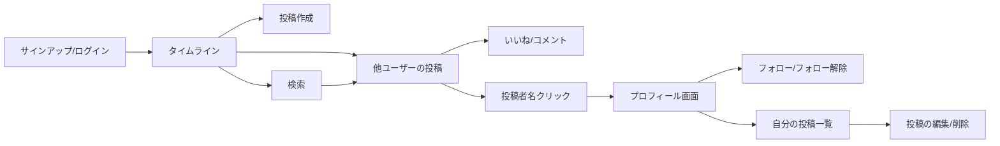

# RaiseTimeLine 要件定義書

## 関連ドキュメント
本書は全体像をまとめた親ドキュメントであり、詳細は以下の各ドキュメントを参照する。

| ドキュメント | 内容 |
|---|---|
| [docs/機能一覧.md](./docs/機能一覧.md) | 全機能のサマリ一覧（対象内・対象外） |
| [docs/機能定義/](./docs/機能定義/) | 機能ごとの詳細定義書（認証、タイムライン、フォロー、プロフィール、投稿、コメント、いいね、画像投稿、検索） |
| [docs/画面設計.md](./docs/画面設計.md) | 画面一覧、画面遷移、レイアウト |
| [docs/データベース設計.md](./docs/データベース設計.md) | ER図、テーブル定義 |
| [docs/技術スタック.md](./docs/技術スタック.md) | 使用言語・フレームワーク・DB製品 |
| [docs/インフラ構成.md](./docs/インフラ構成.md) | AWS上へのデプロイ構成（EC2 + RDS + ALB） |

---

## 1. 概要

### 1.1 プロジェクト名
RaiseTimeLine（テキストベースのタイムライン型SNSアプリケーション）

### 1.2 背景
X（Twitter）のようなタイムライン形式のテキストベースSNSアプリケーションを新規に開発する。要件定義・設計・実装・テスト・デプロイという一連の開発プロセスを通じて、品質と保守性を担保しながらプロダクトを構築する。

### 1.3 目的
タイムライン・フォロー・投稿・コメント・いいね・画像投稿・検索といったSNSの基本機能一式を備え、複数ユーザーが利用できるWebアプリケーションを提供する。

### 1.4 想定利用者
- 複数のユーザーが同時に利用することを前提とする（マルチユーザー対応）
- ユーザー同士が互いに投稿・コメント・いいね・フォローし合う、一般的なSNSの利用形態を想定する

### 1.5 動作環境
- ブラウザで動作するフロントエンドと、REST APIを提供するバックエンド、データを永続化するデータベースで構成するアプリケーションとする
- 画像はAWSのクラウドストレージ（S3）に保存する
- ログイン（メールアドレス＋パスワード認証）が必須の機能であり、未ログイン状態ではタイムライン等の主要機能を利用できない

---

## 2. 用語定義

| 用語 | 説明 |
|---|---|
| 投稿（ポスト） | テキスト（および任意で画像）から成る、タイムラインに表示される1件の発信単位 |
| タイムライン | 投稿が新着順に並ぶ一覧画面。「全体」と「フォロー中」の2種類を持つ |
| フォロー | あるユーザーが別のユーザーの投稿を継続的に見るための関係性。一方向の関係（フォローされた側の承認は不要） |
| いいね | 投稿またはコメントに対する好意的な反応。誰でも（投稿者・コメント者本人以外の第三者も）行える |
| コメント（リプライ） | 投稿に対して付けられるテキストの返信。投稿者本人以外の第三者も投稿できる |
| プロフィール | 各ユーザーの情報（ユーザー名・自己紹介・フォロー/フォロワー数・自身の投稿一覧）を表示する画面 |
| インプレッション数 | 投稿の表示回数。X/Twitterでは表示されるが、本アプリでは実装しない（差別化ポイント） |
| リツイート | 他ユーザーの投稿を自分のタイムラインに転載する機能。本アプリでは実装しない（差別化ポイント） |

---

## 3. スコープ

### 3.1 対象とする機能（実装する）
- ユーザー登録（サインアップ）／ログイン／ログアウト
- タイムライン（全体タイムライン／フォロー中タイムラインの2タブ）
- フォロー／フォロー解除
- プロフィール表示／プロフィール編集
- 投稿の作成／編集／削除（画像添付を含む）
- コメントの作成／編集／削除
- いいね（投稿・コメントの両方が対象、第三者いいね可）
- 画像投稿（AWS S3への保存）
- 検索（キーワード検索・ユーザー検索）

機能の詳細は [docs/機能一覧.md](./docs/機能一覧.md) および [docs/機能定義/](./docs/機能定義/) 配下の各ドキュメントを参照。

### 3.2 対象外（実装しない）
- ユーザーアカウントの削除
- パスワード変更・再設定（パスワードリセット）
- 通知機能・メンション機能
- リツイート／引用機能
- インプレッション数（閲覧数）の表示
- ダイレクトメッセージ

---

## 4. ユースケース・業務フロー

### 4.1 利用シーン

| No | シーン | 操作の流れ |
|---|---|---|
| UC-1 | 新規ユーザーが利用を始める | サインアップ画面でメールアドレス・パスワード・ユーザー名を登録し、ログインする |
| UC-2 | 何かを発信したい | タイムライン上部の投稿フォームからテキスト（＋画像）を投稿する |
| UC-3 | 他ユーザーの投稿に反応したい | 全体タイムラインの投稿にいいね、またはコメントを付ける |
| UC-4 | 気になるユーザーの投稿を継続して見たい | 投稿者名・アイコンからプロフィール画面に遷移し、フォローボタンでフォローする |
| UC-5 | フォロー中ユーザーの投稿だけ見たい | タイムラインの「フォロー中」タブに切り替える |
| UC-6 | 過去の投稿を直したい／消したい | 自分の投稿（タイムライン上またはプロフィール画面上）から編集・削除を行う |
| UC-7 | 自分のコメントを直したい／消したい | 自分のコメントから編集・削除を行う |
| UC-8 | 自分のプロフィールを整えたい | プロフィール編集画面でユーザー名・自己紹介文・アイコン画像を変更する |
| UC-9 | 特定の話題やユーザーを探したい | 検索画面でキーワードまたはユーザー名を検索する |

### 4.2 業務フロー図（イメージ）

---

## 5. 機能要件（概要）

ログイン済みユーザーは、テキスト（および画像）を投稿でき、投稿はタイムラインに新着順で表示される。他ユーザーの投稿にはコメント・いいねができ、それぞれの件数が投稿に表示される。ユーザー名やアイコンから相手のプロフィール画面に遷移でき、そこでフォロー・フォロー解除ができるほか、フォロー中／フォロワーの一覧を確認できる。フォロー中のユーザーの投稿のみを表示する「フォロー中」タイムラインも用意する。自分の投稿・コメントは編集・削除でき、プロフィール情報も編集できる。キーワードによる投稿検索、ユーザー名によるユーザー検索も行える。

詳細な仕様（入力チェック、状態遷移、API方針など）は [docs/機能一覧.md](./docs/機能一覧.md) と [docs/機能定義/](./docs/機能定義/) 配下の各ドキュメントを参照。

---

## 6. 画面仕様（概要）

ログイン画面・サインアップ画面を経て、タイムライン画面（全体／フォロー中の2タブ）を中心に、投稿詳細（コメント一覧）、プロフィール画面（自分・他ユーザー共通、編集は自分のみ）、フォロー中／フォロワー一覧画面、検索画面で構成する。

詳細な画面一覧・画面遷移・レイアウトは [docs/画面設計.md](./docs/画面設計.md) を参照。

---

## 7. 非機能要件

| 分類 | 項目 | 内容 |
|---|---|---|
| 動作環境 | 対応ブラウザ | 最新版の Google Chrome を正式サポート対象とする |
| 動作環境 | 画面サイズ | PC画面での利用を基本としつつ、スマートフォン幅でも崩れずに閲覧できることが望ましい |
| セキュリティ | パスワード | ハッシュ化して保存する（平文保存は禁止） |
| セキュリティ | 認可 | 未ログイン状態ではタイムライン・投稿・コメント・いいね・フォロー等の主要機能を利用できない |
| セキュリティ | 編集・削除権限 | 投稿・コメントは投稿者本人のみ編集・削除できる。プロフィールは本人のみ編集できる |
| 可用性 | 稼働環境 | 初期リリース時点では大規模アクセスへのスケーラビリティは考慮しないが、将来的な拡張の余地を残した構成とする |
| 保守性 | コード構成 | フロントエンド（React）とバックエンド（Spring Boot API）を分離し、可読性・保守性を保つ |
| データ管理 | 画像保存 | 投稿画像・プロフィールアイコン画像はAWS S3に保存する |

---

## 8. 受け入れ基準（完了の定義）

- [ ] ユーザーがサインアップし、ログイン・ログアウトできる
- [ ] ログイン後、全体タイムラインおよびフォロー中タイムラインが表示される
- [ ] テキスト（＋画像）付きの投稿ができ、タイムラインに反映される
- [ ] 自分の投稿・コメントを編集・削除でき、タイムライン上とプロフィール画面上のどちらからも操作できる
- [ ] 任意のユーザーが任意の投稿にコメントでき、コメント数が正しく更新される
- [ ] 任意のユーザーが任意の投稿・コメントにいいねでき、いいね数が正しく更新される（二重いいね不可）
- [ ] 投稿者名／コメント者名からプロフィール画面に遷移できる
- [ ] プロフィール画面でフォロー／フォロー解除ができ、フォロー中タイムラインに反映される
- [ ] プロフィール画面からフォロー中／フォロワーの一覧を確認できる
- [ ] 自分のプロフィール（ユーザー名・自己紹介・アイコン）を編集できる
- [ ] キーワード検索・ユーザー検索が行える
- [ ] 主要機能に対するテストが存在し、CIが通ること

---

## 9. 制約条件・前提条件

| 項目 | 内容 | 根拠 |
|---|---|---|
| 使用技術 | フロントエンド：React（TypeScript）／バックエンド：Java + Spring Boot（Gradle、Spring Data JPA）／データベース：PostgreSQL。詳細は [docs/技術スタック.md](./docs/技術スタック.md) を参照 | 実務での採用実績が豊富で、保守性の高い構成であるため |
| 画像ストレージ | AWS S3 | 画像投稿機能の保存先として決定済み |
| インフラ | AWS上にEC2＋RDS＋ALBを用いた構成を前提とする | マルチユーザー・認証ありのアプリケーションのため、可用性を意識した構成とする。詳細は [docs/インフラ構成.md](./docs/インフラ構成.md) を参照（実際にAWS上へデプロイするかは別途判断） |
| 認証方式 | メールアドレス＋パスワードによる自前実装（外部認証ライブラリ・IdPは使用しない） | 自社での認証仕組みを保有するため |
| ユーザー対応 | マルチユーザー対応を行う | 複数ユーザーが投稿・コメント・いいね・フォローし合う前提のため |

---

## 10. 今後の検討事項（本要件には含めないが将来的な拡張候補）

- 通知・メンション機能
- パスワード再設定機能
- ユーザーアカウント削除機能
- リツイート・引用機能
- ダイレクトメッセージ
- インプレッション数の表示
